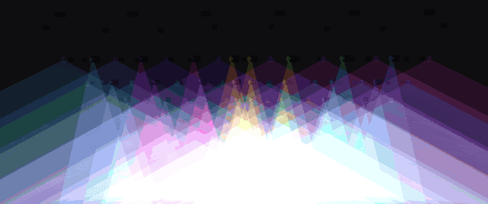

# Effects and fans

An effect is a **wave over one parameter**, locked to the beat, fanned across the
heads of a group. Each part of a look can stack as many as it needs, and they
apply in the order they are listed.

## The wave

| Wave | Feels like |
|---|---|
| **sine** | smooth swell |
| **triangle** | swell with a harder turn |
| **ramp up** | build, then reset |
| **ramp down** | beat-pulse — hit, then decay |
| **square** | on/off gate; `width` sets the duty |
| **chase** | one head at a time across the group; `width` is how many are lit |
| **random** | sample-and-hold flicker, reproducible from its seed |
| **curve** | one you draw: drag its points and bend each segment, and the value holds after the last point until the cycle restarts — a fast ramp then a level held to the end |
| **steps** | a short list of levels you type, each held for an equal share of the cycle; *snap*, *ramp* or *smooth* between them |

**Targets:** dimmer, hue, white, strobe, pan, tilt, zoom, focus, beam size, soften,
warmth, gobo spin, prism spin, and **shape**. A target the group cannot take is
flagged rather than silently ignored.

## Shapes

`shape` is the one target that drives two parameters. Pan and tilt have always
been separate targets with a free phase, so a circle *could* be hand-built from
two effects a quarter-cycle apart — and then it was two rows that had to be
edited in step, could not be saved to the pool as one thing, and fell apart the
moment somebody changed the rate of one of them.

Pick a figure instead:

| Figure | What it looks like |
|---|---|
| **circle** | smooth, one lap a cycle |
| **figure of eight** | crosses itself in the middle, twice a lap |
| **square** | corners you can see the heads hit — mechanical on purpose |
| **drawn path** | one you draw on a pad: the heads visit its points in turn, at an even speed |

There is no wave to pick, because the figure *is* the waveform. Three knobs
replace it:

- **aspect** — round in the middle. All the way one way is a flat pan sweep,
  all the way the other a vertical bounce, and everything between is an ellipse.
- **turn** — rotates the whole figure. A sideways figure of eight becomes an
  upright one at 25%.
- **↻ / ↺** — which way round it is traced.

Everything else works as it does for any effect. `size` is how much of the
head's travel the figure spans, `rate` is how long a lap takes, and the spread
puts each head at a different point on the figure so the beams chase each other
round it. The catalogue ships seven of these under **Position**.

## The knobs

- **rate** — beats per cycle. `4` is one cycle per bar in 4/4, `0.25` is four
  per beat. It is musical, not in hertz, so the rig stays in time when the
  tempo moves.
- **size** — depth. How far the parameter is pushed from where the look set it.
- **spread** — how far the phase is fanned across the group. At 0 every head
  moves together; at 1 the spread covers a full cycle. Chase forces full spread.
- **width** — duty, for square and chase.
- **phase** — a fixed offset, for running two effects against each other.
- **mix** — wet/dry. Useful for easing an effect in without changing its depth.
- **bypass** — parked: the effect is kept, contributes nothing this tick.

The **speed** master in the top bar multiplies every rate at once, 0.25× to 4×,
without jumping any phase — so you can halve the whole rig's motion mid-song and
nothing stutters.

## The spread

The spread is the part worth understanding, because it is what separates a rig that
looks programmed from a rig that looks switched on.

*One effect: a saw on hue, `spread` at 100 %, `distribute: x`. The phase is laid
across the stage by world position, so the colour walks the rig from one side to
the other. Nothing is programmed per fixture, and moving a fixture in the patch
moves its place in the spread.* ([MP4](img/fan-sweep.mp4))

`spread` says *how much* phase difference there is across the group. **distribute**
says *in what order the heads are counted*:

| Basis | Order |
|---|---|
| **index** | patch order — the order the heads appear in the group |
| **x** | left to right across the stage, by real world position |
| **y** | low to high |
| **z** | upstage to downstage |
| **radial** | outward from the centre of the group — a ripple |
| **shuffle** | a seeded scatter; re-roll the seed for a different one |
| **row** / **col** | the fixture's own pixel grid, *within* each fixture |

`row` and `col` are the ones that make a rig of multi-pixel fixtures behave:
every strobe runs the same pixel wave by construction, whatever order they were
patched in.

Then three modifiers:

- **fold** — `mirror` puts the ends in phase and sweeps toward the centre (the
  wings figure); `centre` leads from the middle and trails at the ends.
- **reverse** — run the order backwards.
- **tile** — tile the spread into *k* repeats across the group.
- **buddy** — clump adjacent heads so pairs (or threes) share a phase.

These compose. A saw on dimmer, `distribute: x`, `fold: mirror`, `parts: 2` is
two mirrored wipes running outward from two points on the truss — one effect,
four numbers, and no per-fixture programming.

Because positions come from the patch, a spread by `x` keeps working when you move
a fixture. Nothing needs re-teaching.

## Modifier looks

An effect-only look on the *dims* row has always shaped the wash beneath it —
but only its brightness, and only on that row. A **modifier look** is the
general form: Arena's effect clip as a property of the look. Tick **modifier**
in the look editor (beside *flash*) and the look stops painting the rig and
starts shaping what is under it, on any row, whatever that row's blend says.

Its values are read as deltas from each parameter's neutral: a dimmer chase
dims the composite below, a hue effect turns its colour, a tilt effect swings
its aim around wherever the wash aims, a zoom effect swings the beam about
mid-travel when nothing below has zoomed, a strobe adds the faster shutter and
a white pulse adds the brighter white. The row's master still scales how deep a
modifier bites on brightness, and only that — a colour turn, an aim or beam
swing, a strobe or a white are not a master's business, on this row as on any
other.

The recipe: build a look with no parameters enabled and one effect, tick
**modifier**, put it on the row above the wash. The audition shows it over
whatever is playing beneath that row, the way Arena previews an effect over the
clip that is playing.

Three caveats. Over an empty row a modifier shows nothing — there is nothing to
shape. Over a white wash a colour turn does nothing — white has no hue to turn.
And the row's blend does not apply to a modifier; it does the same thing on a
*replaces*, *dims* or *brightest* row. A *steps* look is a modifier through
the steps it plays, so the toggle is not offered on one.

## Ready-made effects

**browse…** beside `+ effect` opens the catalogue: 55 named starting points in
four groups — Intensity, Colour, Position and Beam — each with its target, its
wave and its speed in musical time, and a sentence on when to reach for it. Search matches the name, the description and the group, so
"beat", "slow" and "chase" all find something.

Picking one applies it to the part **straight away** and leaves the list open,
so the next pick swaps it out: you audition by clicking down the list and
watching the stage. **keep** closes on whatever is playing, **cancel** (or
Escape) takes it back out, and either way it is an ordinary edit that `⌘Z`
undoes by name.

A preset whose target this group cannot take is flagged rather than hidden — a
pan sweep is still worth reading about on a rig of pars, and the same effect is
useful the moment you drop it on a group that moves.

Every preset is a starting point, not a finished thing. The knobs above are all
still there, and the ones that came from the catalogue are no different from the
ones you build by hand.

## Reusing your own

`☆` saves an effect to the FX pool as a preset, ready to drop onto another part.
The pool is per show, and it is the same copy-on-apply as the catalogue: the
preset is a stamp, so editing a look never rewrites it and editing it never
changes a look already using it.

## Worked examples

**Slow breathing wash.** sine on dimmer, rate 16, size 0.25, spread 0.5,
distribute `x`, fold `mirror`. The room lifts and falls, the ends leading.

**Beat chase across the bar.** chase on dimmer, rate 1, width 0.18,
distribute `x`. One head per beat, left to right, regardless of patch order.

**Rainbow spread.** ramp up on hue, rate 8, size 1.0, spread 1.0, distribute `x`.
A full spectrum laid across the stage, cycling once per two bars.

**Nervous flicker.** random on dimmer, rate 0.25, size 0.7, spread 1.0,
distribute `shuffle`. Reproducible — the same seed gives the same scatter every
night.
